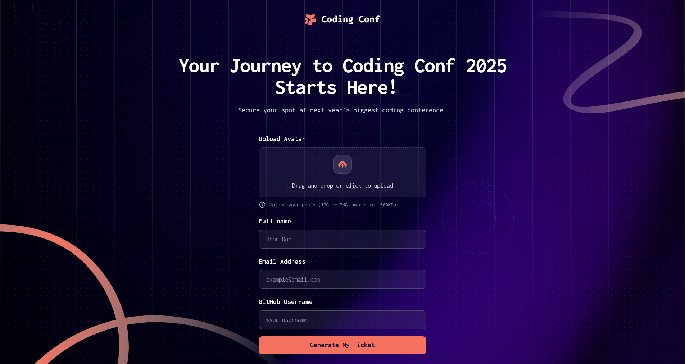
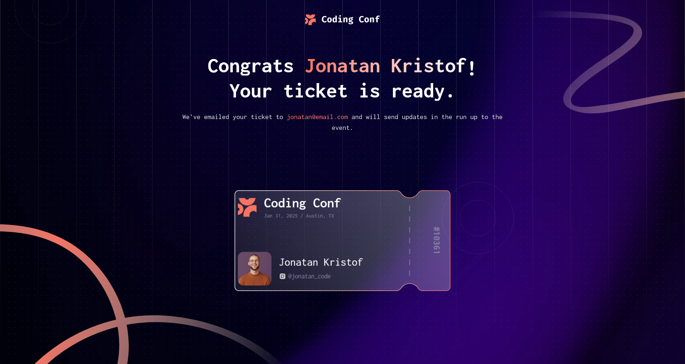

# Frontend Mentor - Conference ticket generator solution

This is a solution to the [Conference ticket generator challenge on Frontend Mentor](https://www.frontendmentor.io/challenges/conference-ticket-generator-oq5gFIU12w). Frontend Mentor challenges help you improve your coding skills by building realistic projects.

## Table of contents

- [Overview](#overview)
  - [The challenge](#the-challenge)
  - [Screenshot](#screenshot)
  - [Links](#links)
- [My process](#my-process)
  - [Built with](#built-with)
  - [What I learned](#what-i-learned)
- [Author](#author)

## Overview

### The challenge

Users should be able to:

- Complete the form with their details
- Receive form validation messages if:
  - Any field is missed
  - The email address is not formatted correctly
  - The avatar upload is too big or the wrong image format
- Complete the form only using their keyboard
- Have inputs, form field hints, and error messages announced on their screen reader
- See the generated conference ticket when they successfully submit the form
- View the optimal layout for the interface depending on their device's screen size
- See hover and focus states for all interactive elements on the page

### Screenshots

### Links

- Solution URL: [GitHub Repository](https://github.com/laerte-quinui/conference-ticket-generator)
- Live Site URL: [Conference Ticket Generator](https://conference-ticket-generator-six-dusky.vercel.app/)

## My process

### Built with

- Semantic HTML5 markup
- CSS custom properties
- Mobile-first workflow
- [React](https://reactjs.org/) - JS library
- [TypeScript](https://www.typescriptlang.org/) - JavaScript with types
- [Tailwind CSS](https://tailwindcss.com/) - For styles
- [Vite](https://vite.dev/) - Build tool
- [React Bits](https://reactbits.dev/) - Library of animated components

### What I learned

Usually I just avoid designing and devolping backgrounds full of textures, images and particles, but this one was really fun! Get out of my confort-zone really helped me to be more creative and increment the background even more with the dot grid animation.

I am full of new ideas and I'm really excited to develop more lifeful backgrounds!

## Author

- GitHub - [Laerte Quinui](https://github.com/laerte-quinui)
- Frontend Mentor - [@laerte-quinui](https://www.frontendmentor.io/profile/laerte-quinui)
